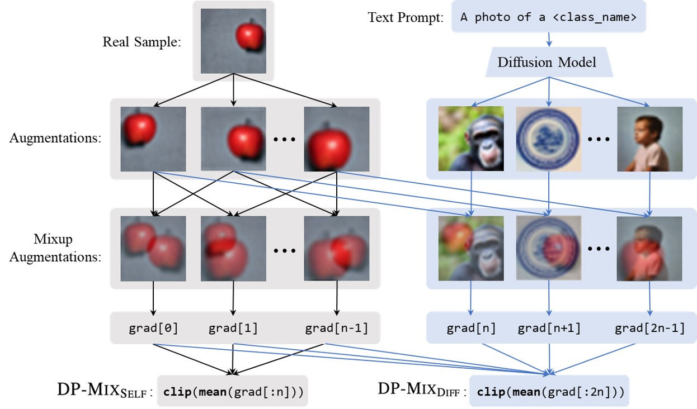

This is the code to reproduce the methods proposed in "DP-Mix: Mixup-based Data Augmentation for
Differentially Private Learning". Please refer to the paper for more details.

**Paper:** https://proceedings.neurips.cc/paper_files/paper/2023/hash/28484cee66f27fa070796b631cc5242d-Abstract-Conference.html

**Website:** https://dp-mix.github.io/

(This code is based on the code of tan: https://github.com/facebookresearch/tan)